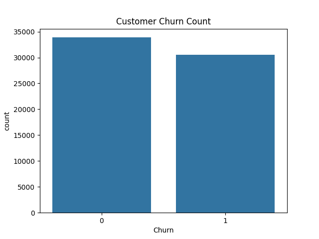
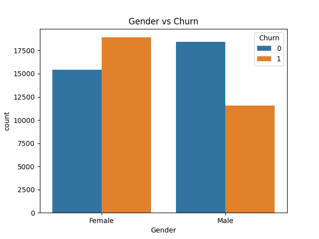
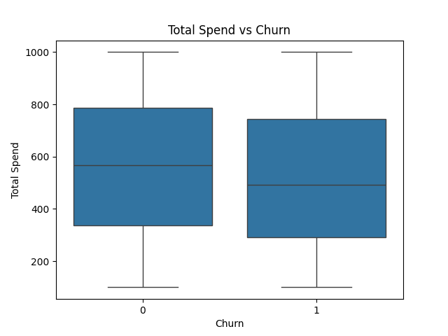

# Customer Churn Analysis Mini Project

## Tools Used
- Python
- Pandas
- Matplotlib
- Seaborn
- GitHub Codespaces

## Objective
Analyze customer churn patterns using customer data.

## Features
- Customer churn analysis
- Churn percentage calculation
- Multiple graphs
- Customer insights
- Conclusion section

## Customer Insights
1. Customers with higher spending tend to churn more.
2. Churn behavior varies across customer groups.
3. Data analysis helps businesses improve retention.

## Conclusion
Customer churn analysis helps businesses identify customers likely to leave and take preventive actions.

## Project Output

### Churn Count Graph

### Gender vs Churn

### Total Spend vs Churn

